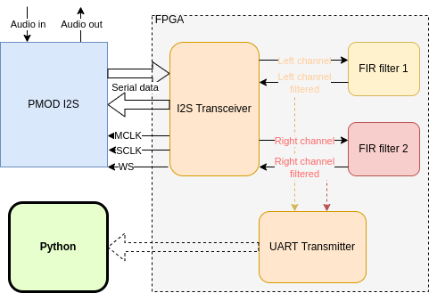

# PMOD I2S implementation with FIR filter

Management and Analysis of Physical Dataset course A.Y. 2021/2022.

## Group 5:

    - Agosti Luca
    
    - Attar Aidin
    
    - Baci Ema
    
    - Coppi Alberto

## Professors:

- Prof. Gianmaria Collazuol,

- Prof. Andrea Triossi,

- Prof. Antonio Bergnoli

## Repository organization:
    
    - The folder final_project.srcs contains the final files ready to be used in the computer connected to the FPGA.
    
    - The Jupyter Notebook contains all python code used for calibration and data analysis

## Abstract

The goal of this lab project is the implementation of a simple FIR-filter on a FPGA and its employment in an audio system obtained using a PMOD I2S2. Our task is to write down the VHDL source code that will be synthetized and implemented in the hardware.\\
The top entity implemented is shown in Fig. \ref{fig:top_scheme}. The filter block communicates with both the PC and the PMOD. Input data, digitized by the PMOD, are retrieved through a I2S receiver, filtered, and then sent back through a I2S transmitter; filtered data are also sent through a UART transmitter to the PC.

 

Figure 1: Scheme of communication between all the components of this project.
